# Hey there! 👋 I'm Bryan Fung

###  A passionate Full Stack Developer from the United States

[View My Website](https://bryan-portfoliodev.vercel.app/) | [Connect on LinkedIn](https://www.linkedin.com/in/bryan-fung-a2a089256/)

---
 

---

### 🌱 Currently Exploring
Refining my skills in **Distributed Systems** and **AI Integration** to build more scalable, intelligent applications.

 

### 🚀 Check out my Projects
* **SJU Campus HUB**: 1st Place Hackathon winner, a Hub built to connect the community of SJU.
* **Dragon Bot**: A comprehensive Discord application for Clash of Clans management.
* **AdaptIQ**: 34d Place Hackathon for 2026, an AI-integrated PowerPoint productivity tool.

 

### 💬 Ask me about
Full-stack development, software engineering, systems programming or chess.

 

### 📊 My GitHub Metrics

---

